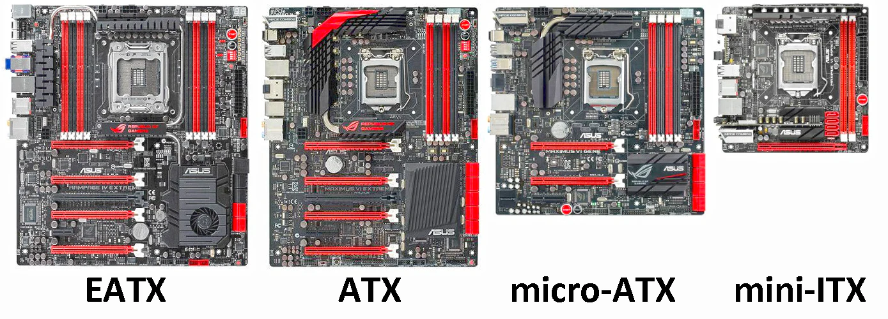

# Índice

- [7.6 Consejos prácticos](#76-consejos-prácticos)
- [8. **Slots de expansión**](#8-slots-de-expansión)
  - [8.1 El Bus PCI Express (PCIe): Funcionamiento y Estructura](#81-el-bus-pci-express-pcie-funcionamiento-y-estructura)
    - [8.1.1 Estructura y concepto de "líneas" (lanes)](#811-estructura-y-concepto-de-líneas-lanes)
    - [8.1.2 Ventajas técnicas de PCIe](#812-ventajas-técnicas-de-pcie)
    - [8.1.3 Versiones PCIe y ancho de banda por línea](#813-versiones-pcie-y-ancho-de-banda-por-línea)
    - [8.1.4 Cómo afecta al usuario](#814-cómo-afecta-al-usuario)
    - [8.1.5 Tipos físicos de slots y ejemplos de uso](#815-tipos-físicos-de-slots-y-ejemplos-de-uso)
  - [8.2 M.2](#82-m2)
    - [8.2.1 Ejemplo de configuración](#821-ejemplo-de-configuración)
    - [8.2.2 Consejos técnicos y consideraciones](#822-consejos-técnicos-y-consideraciones)
- [9. **VRM (Voltage Regulator Module)**](#9-vrm-voltage-regulator-module)
  - [9.1. Concepto y función esencial](#91-concepto-y-función-esencial)
  - [9.2. Estructura de un VRM moderno](#92-estructura-de-un-vrm-moderno)
  - [9.3. Importancia del VRM en 2025](#93-importancia-del-vrm-en-2025)
  - [9.4. Número de fases y su relevancia](#94-número-de-fases-y-su-relevancia)
  - [9.5. Consejos de usuario y técnico](#95-consejos-de-usuario-y-técnico)
- [10. **Nuevas tecnologías**](#10-nuevas-tecnologías)
- [11. **Instalación y mantenimiento**](#11-instalación-y-mantenimiento)

---

# 0. Definición y Función General (Placa base)

La **placa base** es la plataforma esencial donde se interconectan todos los componentes del ordenador: CPU, RAM, almacenamiento, tarjetas de expansión y periféricos. Determina compatibilidad, escalabilidad, rendimiento y posibilidades de actualización.

---

# 1. Vocabulario Fundamental

| **Término** | **Definición** |
|---------------------|----------------------------------|
| **Cuello de botella** | Limitación de rendimiento causada porque un componente (CPU, GPU, RAM, SSD) es más rápido que el resto de la cadena y la transmisión de datos se ve frenada; hoy afecta sobre todo a buses y almacenamiento en gaming de alta gama. |
| **Coma flotante** | Notación para representar números reales con mucha precisión, clave en procesadores y sobre todo en IA moderna y tarjetas gráficas, que ahora realizan trillones de cálculos de coma flotante por segundo. |
| **Factor de forma** | Estándar físico de placas base y chasis: ATX, MicroATX, MiniITX, y el nuevo BTF (Back To Front) en cableado oculto; las RAM CAMM2 empiezan a desplazar a SO-DIMM en portátiles. |
| **Fan (ventilador)** | Elemento crítico de refrigeración. Ahora mayoría incluyen control digital (PWM), sensores de temperatura y efecto RGB sincronizable. |
| **FSB** | Bus frontal ya obsoleto, sustituido hoy por buses PCIe, DMI (Intel) o Infinity Fabric (AMD). |
| **Gigahercio (GHz)** | Unidad de frecuencia. CPUs actuales alcanzan más de 5.5 GHz. RAM DDR5 para gaming puede correr a 8000+ MHz. |
| **Memoria flash** | Base de SSDs NVMe y UltraRAM, que superan en velocidad a discos SATA convencionales. |
| **Nanosegundo** | Tiempo mínimo de acceso en chips RAM y SSD. Hoy se dan valores de 7–12 ns en memorias premium. |
| **Nanómetro** | Milmillonésima parte de un metro; hace referencia al proceso de fabricación de chips: 3nm y 4nm dominan en CPUs y GPUs actuales. |

---

# 2. Factor de forma

El **factor de forma** define las dimensiones físicas, el diseño de los conectores y la organización interna de la placa base, lo que determina la compatibilidad con chasis, fuentes de alimentación y componentes. Elegir el adecuado afecta la capacidad de expansión, refrigeración, estética y futuro upgrade del sistema.

---

---

## 2.1 Concepto y importancia

- Un factor de forma es un estándar que dicta cómo se fabrican y disponen las placas base y sus componentes. Su objetivo es garantizar compatibilidad entre placas, torres y demás hardware modular.
- Afecta a:
  - Número y tipo de ranuras de expansión (PCIe, M.2, RAM).
  - Posiciones de puertos traseros, alimentación, refrigeradores.
  - Tamaño de la caja, facilidad de montaje y ventilación.

---

## 2.2 Factores de forma más utilizados (2025)

| Factor de forma | Dimensiones (mm) | Puestos de expansión | Uso principal | Compatibilidad chasis |
|-------------------|------------------|----------------------|------------------------------|----------------------------|
| ATX | 305 x 244 | 7 PCIe + 4–8 RAM | Gaming, workstation, desktop | Universal |
| MicroATX | 244 x 244 | 4 PCIe + 2–4 RAM | Oficina, gaming compactos | ATX/MicroATX |
| MiniITX | 170 x 170 | 1 PCIe + 2 RAM | HTPC, ultracompactos, SFF | Mini/micro ATX, ITX |
| E-ATX | 305 x 330 | 8 PCIe + 8 RAM | Workstation, gaming extremo | Full Tower, E-ATX |
| XL-ATX | Hasta 345 x 262 | 8+ PCIe + 8+ RAM | Servidor | Full Tower XL, server rack |
| DTX/Mini-DTX | 203 x 244/170x203 | 2 PCIe + 2 RAM | SFF, embebidos, industria | Mini/Micro ATX, DTX |
| BTF/Back Connect | Variable | Mismas que ATX/ITX | PC moderno cableado limpio | Chasis BTF homologados |
